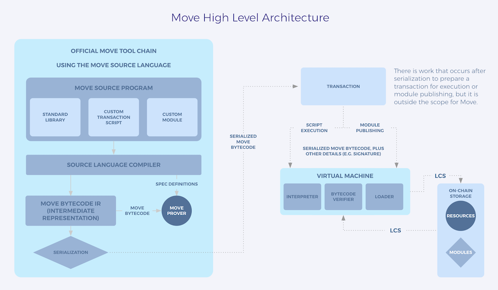

# Domain Modeling Introduction

To plan your dApp, you'll write a user journey and then model your dApp's domain.

A domain model is a visual representation of the concepts and objects related to your dApp. There's no "right" or "wrong" format for domain modeling. As long as the model accurately represents all the components of your dApp's domain in a way that helps you buidl, you're good!

## Example: The Domain Model for Move

Using the architecture diagram for Move, we can understand how a picture is worth a thousand - or at least a few dozes - words:

The first thing that stands out is that the Move high level architecture is divided into two parts, linked by the dashed arrow labeled "SERIALIZED MOVE BYTECODE".

We can see steps to compile Move code on the left side of the diagram:

1. The Move source program's "ingredients" (the Move stdlib and custom scripts and modules) are submitted to the source language compiler.
2. The Move code is compiled into an intermediate language.
3. The intermediate language is serialized into Move bytecode.

All of the above is boxed in and labeled "Move tool chain" so we can visually see that those parts of the system are one group.

The dashed arrow conveys a sense of the serialized Move bytecode embarking on a journey, ending in its execution:

1. A script is executed or a module is published (or both). 
2. The Move Virtual Machine receives and processes the transaction bytecode as well as other txn details, such as the signature. 
3. Lifecycle services help coordinate the MoveVM writing to and reading from storage.

As you can see, something as magnificent as the Move programming language, can be represented in a relatively simple diagram.

## As you plan your dApp or service you'll build on Movement: 

First you'll write out your user's journey as they experience what you're building. 

Then you'll create a diagram of the system to represent that journey.

You'll even label your diagram with Move code, so when it's time to write your codebase, you'll already know how everything will fit together.

This will save you tons of time and heavy lifting as you build your dream dApp.

Let's Move!