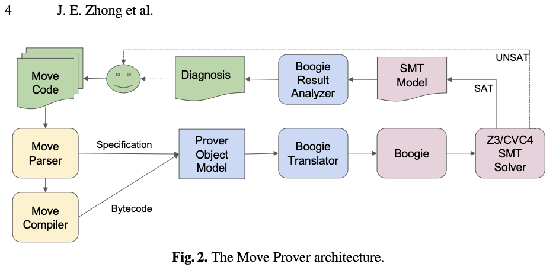

# Safety
🚧 Under renovation. Please check back later.

## [The Move Prover](https://www-cs.stanford.edu/~yoniz/cav20.pdf)

  

<small color="gray">Diagram of the Move Prover Architecture</small>

[The Move Prover](https://www-cs.stanford.edu/~yoniz/cav20.pdf) is a formal verification tool specifically designed for the Move programming language. The Move Prover performs static analysis of Move programs, exploring all possible execution paths and applying various verification techniques. It can reason about program behaviors, ownership and borrowing rules, resource lifecycles, and other aspects of Move's type system and semantics. By leveraging the Move Prover, developers can gain increased confidence in the correctness and security of their Move smart contracts. This tool helps identify potential issues before deployment, reducing the risk of vulnerabilities, ensuring adherence to best practices, and promoting the development of robust and reliable blockchain applications.

